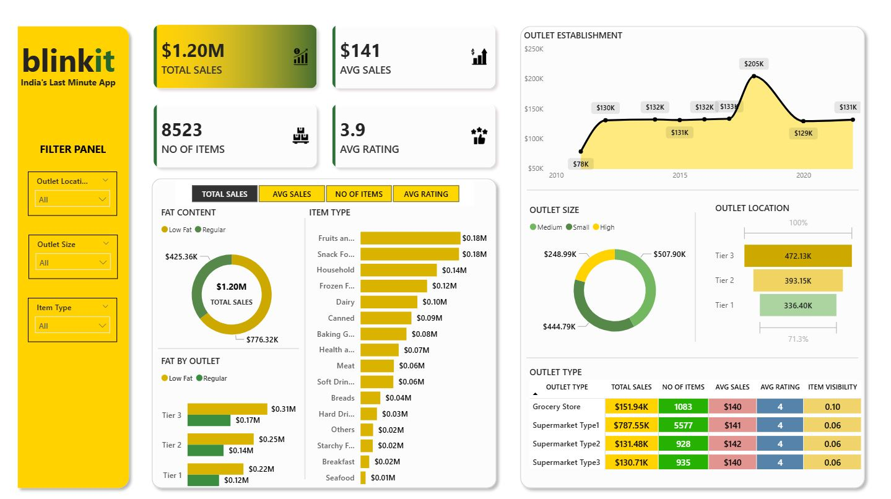

 📊 Blinkit Sales Analysis | Power BI Dashboard
📌 Project Overview

This project presents a comprehensive sales performance analysis of Blinkit using Power BI. The dashboard focuses on understanding sales trends, customer preferences, outlet performance, and inventory distribution through key KPIs and interactive visualizations to support data-driven decision-making.

🎯 Business Objective

To analyze Blinkit’s:

Sales performance

Customer satisfaction

Inventory distribution

and identify key insights and optimization opportunities using various KPIs and visual analytics in Power BI.

📈 Key Performance Indicators (KPIs)

Total Sales: Overall revenue generated from all items sold

Average Sales: Average revenue per sale

Number of Items: Total count of different items sold

Average Rating: Average customer rating of items

📊 Dashboard Visualizations & Analysis
1. Total Sales by Fat Content

Objective: Analyze the impact of fat content on total sales

Additional Metrics: Average Sales, Number of Items, Average Rating

Chart Type: Donut Chart

2. Total Sales by Item Type

Objective: Identify top-performing item categories

Additional Metrics: Average Sales, Number of Items, Average Rating

Chart Type: Bar Chart

3. Fat Content by Outlet for Total Sales

Objective: Compare outlet sales segmented by fat content

Additional Metrics: Average Sales, Number of Items, Average Rating

Chart Type: Stacked Column Chart

4. Total Sales by Outlet Establishment

Objective: Evaluate how outlet age/type influences total sales

Chart Type: Line Chart

5. Sales by Outlet Size

Objective: Analyze the correlation between outlet size and total sales

Chart Type: Donut / Pie Chart

6. Sales by Outlet Location

Objective: Assess geographic distribution of sales

Chart Type: Funnel Map

7. All Metrics by Outlet Type

Objective: View all key metrics by outlet type in one place

Metrics: Total Sales, Average Sales, Number of Items, Average Rating

Chart Type: Matrix Card

🛠 Tools & Technologies

Power BI – Data modeling, DAX, and dashboard creation

Data Visualization – Interactive charts and KPI cards

## 📸 Project Screenshots

